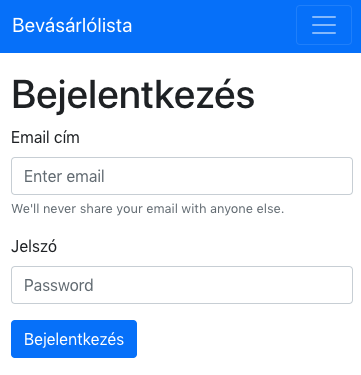
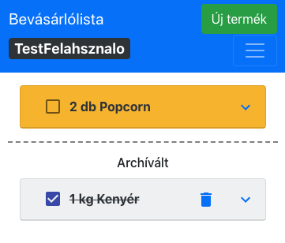
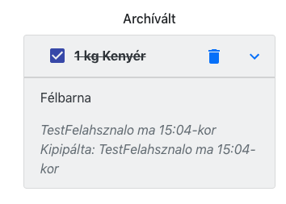
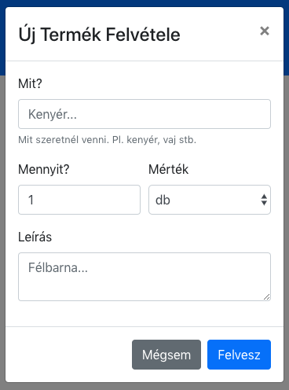

# ReactTypeScriptShoppingList

It is my free time project, that you can manage your shopping list syncronised with your family or friends.

It's reasponseive and made with React, Redux, Firebase, Firestore and TypeScript.

### Hosted in: https://shoppinglist.martinhuszti.codes/

### Screenshots

